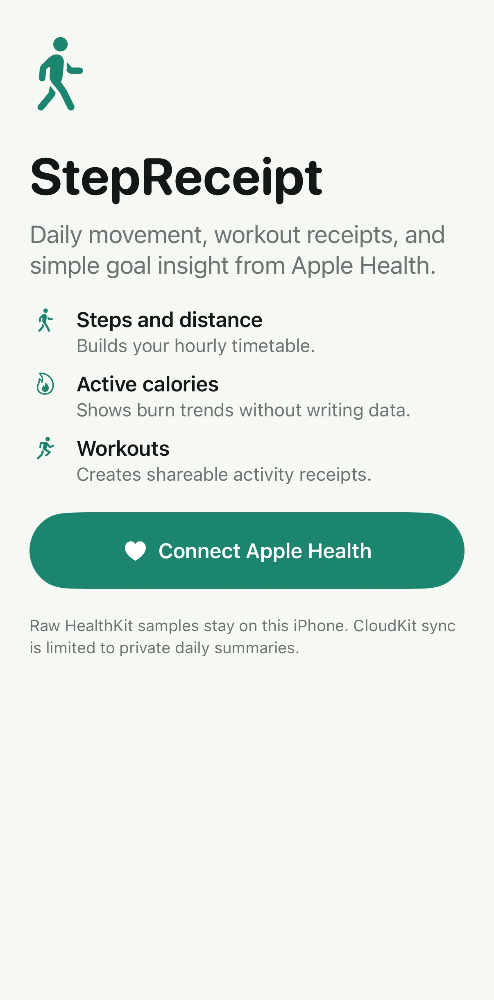
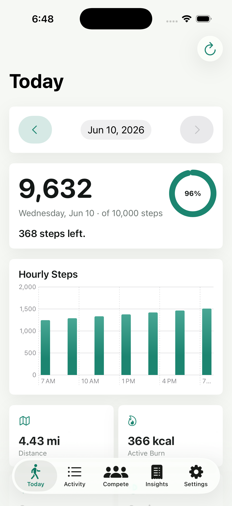

# StepReceipt

StepReceipt is a native SwiftUI iPhone app for daily movement, workout history, shareable activity receipts, and simple Apple Health insights.

Raw HealthKit samples stay on the device. CloudKit sync is limited to private aggregate summaries, goals, and preference-shaped app data.





## Features

- Today dashboard with hourly steps, distance, active calories, flights, workouts, and goal progress.
- Date controls for reviewing previous days within the recent activity window.
- Activity history with scrollable daily summaries, day filters, sorting, and workout type filtering.
- Workout detail pages with duration, distance, burn, source, and share actions.
- Insight receipt with totals, best day, best month, daily average, streaks, and goal pacing.
- Share-card flow for workout and receipt snapshots.
- Competition tab with aggregate-only leaderboards, rank, gap insight, and challenge-ready models.
- Settings for display name, miles/kilometers, visible Today metrics, step goal, workout goal, and optional calorie goal.
- Sample preview mode for simulator runs, denied Health access, and public demo screenshots.

## Architecture

- `HealthKitClient` requests Health read authorization and queries steps, walking/running distance, active energy, flights climbed, and workouts.
- `HKStatisticsCollectionQuery` powers hourly and daily metric buckets.
- `ActivityRepository` normalizes HealthKit reads into app state, cached summaries, receipts, competition state, and sample preview data.
- `InsightEngine` is pure Swift logic for daily aggregation, averages, best day/month, streaks, goal pacing, filters, and sync-record shaping.
- `CloudKitSummarySync` writes only daily aggregate records to the user's private CloudKit database.
- `StepReceiptCore` is shared by the app and tests so analytics can be validated without launching iOS.

## Privacy

This repo can be public without exposing personal activity data. It contains source code, generated sample screenshots, and a CloudKit container identifier, but it does not contain real HealthKit samples.

- Reads from HealthKit only after user consent.
- Does not write workouts or health samples in v1.
- Does not upload raw workouts, hourly buckets, or HealthKit samples.
- Syncs only `SyncedSummaryRecord`-style aggregate daily totals to the user's private CloudKit database.
- Keeps the app useful when HealthKit, iCloud, or individual metric permissions are unavailable.
- Defers real friend sharing and shared leaderboards until CloudKit sharing rules are designed.

## Requirements

- Xcode 26 or newer with iOS 17+ support.
- XcodeGen.
- iOS 17 minimum deployment target.
- Physical iPhone for real HealthKit validation.
- Apple Developer team for device signing, HealthKit capability, and CloudKit container setup.

Install XcodeGen with Homebrew if needed:

```bash
brew install xcodegen
```

## Run Locally

```bash
git clone <your-repo-url>
cd step-receipt-ios
xcodegen generate
open StepReceipt.xcodeproj
```

`StepReceipt.xcodeproj` is committed for convenience and can be regenerated from `project.yml`. If XcodeGen changes the project file, review the generated diff before committing it.

In Xcode, set a real Development Team, confirm HealthKit and iCloud/CloudKit capabilities, then run on a physical iPhone for real Apple Health data.

The simulator path is useful for UI work. Use **Preview Sample Data** on the onboarding screen to exercise the app without HealthKit data.

## Fork Setup

Before shipping a fork or using a different Apple Developer account:

- Change the bundle identifier from `com.tyronsamaroo.stepreceipt`.
- Change the CloudKit container from `iCloud.com.tyronsamaroo.stepreceipt`.
- Set `DEVELOPMENT_TEAM` in Xcode or `project.yml`.
- Create/enable matching HealthKit and CloudKit capabilities for the selected team.

## Validation

These checks are the current local validation path:

```bash
xcodegen generate
swift run StepReceiptCoreCheck
swift test --enable-swift-testing
xcodebuild -project StepReceipt.xcodeproj -scheme StepReceipt -destination 'platform=iOS Simulator,name=<installed iPhone simulator>' build
xcodebuild -project StepReceipt.xcodeproj -scheme StepReceipt -destination 'platform=iOS Simulator,name=<installed iPhone simulator>' build-for-testing
xcodebuild -project StepReceipt.xcodeproj -scheme StepReceipt -destination 'platform=iOS Simulator,name=<installed iPhone simulator>' test
```

The latest local validation used `platform=iOS Simulator,name=iPhone 17,OS=26.5`.

Real HealthKit and CloudKit behavior still need physical-device validation with the final Apple Developer team.

## CloudKit Data Shape

Only aggregate daily summaries are synced:

| Field | Meaning |
| --- | --- |
| `dayKey` | Calendar day identifier |
| `dateStart` | Start of the summarized day |
| `steps` | Daily step total |
| `distanceMeters` | Daily walking/running distance total |
| `activeEnergyKilocalories` | Daily active energy total |
| `flightsClimbed` | Daily flights total |
| `workoutMinutes` | Daily workout duration total |
| `workoutCount` | Count of workouts touching the day |
| `stepGoal` | Step goal used for that summary |
| `updatedAt` | App sync timestamp |

Raw samples, hourly buckets, workout source IDs, and individual workout details are intentionally excluded.

## Production Checklist

- Set `DEVELOPMENT_TEAM` in `project.yml` or Xcode before device/App Store builds.
- Confirm the CloudKit container `iCloud.com.tyronsamaroo.stepreceipt` exists for the selected Apple Developer team.
- Run on a physical iPhone to verify HealthKit permission prompts, partial Health permissions, and real step/workout reads.
- Verify iCloud disabled/offline behavior on device.
- Add fake CloudKit offline/conflict tests before turning competition into real friend sharing.
- Prepare App Store privacy labels around HealthKit reads and private aggregate CloudKit sync.

## Roadmap

- Device-tested HealthKit onboarding and partial-permission handling.
- CloudKit conflict/offline test doubles.
- Friend invites and shared challenge zones.
- Widgets and lock-screen summaries.
- Exportable weekly and monthly receipt cards.
